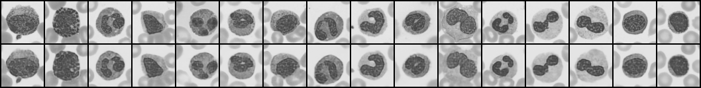

# HoloReconstruct

Physics-informed holographic image reconstruction. A CVAE-GAN trained with a
differentiable Angular Spectrum Method (ASM) physics loss reconstructs clean
images from noisy holograms, served through a FastAPI backend with a hand-built
dashboard and a local LLM agent.

Built end to end on free, open-source tools and consumer hardware (GTX 1650 +
free Colab T4). No paid APIs anywhere.



*Real blood cells (top) and their reconstructions from noisy holograms (bottom). The network recovers nucleus shape, cell boundary, and type from hologram noise at 0.89 SSIM.*

## The problem

To image something tiny and transparent (a living cell, a microplastic, a chip
defect), a normal microscope forces you to either stain the sample, which often
kills it, or give up on its true 3D structure. A normal camera records only
brightness and throws away the phase of the light wave, which carries depth.

Holography keeps the phase: a laser produces an interference pattern (a hologram)
that encodes the structure. But a raw hologram looks like noisy static, and
turning it back into a clean image classically needs slow, fragile math that
breaks under noise.

## The solution

Two pieces working together:

1. A physics simulator (ASM) that turns any image into a physically accurate
   synthetic hologram. This generates unlimited training data for free.
2. A CVAE-GAN that learns to reverse the process, hologram back to clean image.
   The ASM equation is baked into the loss (a differentiable physics loss), so
   the network cannot cheat: its output must obey the laws of optical
   propagation. This is what makes it robust where classical methods fail.

Real-world payoff: label-free cell screening, microplastic monitoring, and chip
inspection, faster and without destroying the sample.

## Results

Two datasets, easy to hard. Metrics on held-out test sets, compared against a
naive analytic baseline (ASM back-propagation with no network).

### MNIST digits (pipeline validation)

| Method | PSNR (dB) | SSIM |
|--------|-----------|------|
| Neural model (CVAE-GAN + physics loss) | 39.32 | 0.9963 |
| Analytic baseline | 18.03 | 0.3273 |
| Improvement | +21.29 | +0.669 |

### BloodMNIST (real cell microscopy, the medical result)

Trained on 17,092 real blood-cell microscopy images across 8 cell types,
evaluated on 3,421 held-out cells.

| Method | PSNR (dB) | SSIM |
|--------|-----------|------|
| Neural model (CVAE-GAN + physics loss) | 30.77 | 0.8912 |
| Analytic baseline | 10.93 | 0.1622 |
| Improvement | +19.84 | +0.729 |

The classical baseline essentially fails on cells (SSIM 0.16 is almost no
structural similarity). The physics-informed network takes reconstruction from
unusable to clinically legible. Cell numbers are lower than MNIST because real
tissue texture is genuinely harder, which is the honest, defensible result.

Note: holograms are ASM-simulated (physics-simulated holography, as in
GedankenNet-style work), not captured on a physical lensless microscope. The
reconstruction is real; the hologram formation is simulated.

## Architecture

```
TRAINING
  images  ->  ASM simulator  ->  synthetic holograms  ->  CVAE-GAN
              (physics)           (training pairs)         (physics-informed loss)
                                                                |
                                                          generator.pt (~2M params)

DEPLOYMENT
  generator.pt  ->  FastAPI backend  ->  dashboard  <-  user uploads image

AGENT (local, Ollama)
  browser chat  ->  /agent endpoint  ->  LangGraph state machine  ->  local LLM
                                              |
                                    calls real tools (z-sweep, sharpness)
                                    on the same loaded model
```

The four-term loss:

```
L_total = a*L_pixel + b*L_KLD + g*L_adversarial + d*L_physics
```

L_pixel (geometry), L_KLD (smooth latent), L_adversarial (sharpness from a
PatchGAN critic), and L_physics (re-propagate the reconstruction through ASM and
match the input hologram). The physics term is the differentiator.

## Folder map

```
holoreconstruct/
  core/                     the machine-learning core
    propagation_asm.py      ASM physics engine (forward + inverse, differentiable)
    dataset.py              MNIST image to synthetic hologram pipeline
    dataset_blood.py        BloodMNIST cell pipeline (same interface)
    networks.py             CVAE-GAN: encoder, U-Net generator, PatchGAN
    train.py                training loop (4-term physics-informed loss)
    train_blood.py          training loop wired for cells
    evaluate.py             PSNR / SSIM vs. analytic baseline (MNIST)
    evaluate_blood.py       PSNR / SSIM vs. analytic baseline (cells)
  backend/
    main.py                 FastAPI server (loads models/generator.pt)
    agent_service.py        web wrapper around the LangGraph agent
  agent/
    tools.py                the agent's callable tools (z-sweep, sharpness)
    agent.py                raw from-scratch agent loop (Ollama)
    agent_langgraph.py      the same agent as a LangGraph state machine
  frontend/
    index.html             the dashboard (upload, reconstruct, agent chat)
  models/
    generator.pt           trained weights (not committed, see models/README.md)
  requirements.txt
  README.md
```

## Quick start

From the project root, with your environment active:

```bash
pip install -r requirements.txt

# get a model: retrain (python core/train.py or core/train_blood.py)
# then copy the resulting generator.pt into models/

uvicorn backend.main:app --port 8000
```

Open http://localhost:8000 for the dashboard, or http://localhost:8000/docs for
the auto-generated API. Visit http://localhost:8000/health to confirm the model
loaded (`"model_loaded": true`).

## The agent

An optical-engineer assistant lives in the dashboard. When a reconstruction
looks blurry, the usual cause is a wrong propagation distance z. The agent can
sweep z, measure reconstruction sharpness at each value, and report the sharpest
setting, all through tool calls to the real model.

It is built twice: once as a raw Python loop (agent/agent.py) to show the
perceive-reason-act-observe cycle with nothing hidden, and once as a LangGraph
state machine (agent/agent_langgraph.py) to show the framework version. Both use
the same tools and a local Ollama model (no API key, no cost). To run the agent:

```bash
# install Ollama from ollama.com, then:
ollama pull llama3.2:3b
python agent/agent.py
```

The dashboard's agent panel uses the LangGraph version and reuses the backend's
already-loaded model.

## Tech stack

PyTorch, torch.fft (differentiable ASM), NumPy, FastAPI + Uvicorn, scikit-image
and torchmetrics (PSNR/SSIM), TensorBoard, MedMNIST, Ollama, LangGraph. Frontend
is hand-written HTML/CSS/JS (IBM Plex type, no templates).

## Related work

GedankenNet (UCLA, 2023), Deep Phase-Only Holography, and HDPhysNet (2024) all
combine physical propagation models with generative networks for hologram
reconstruction.

## License

MIT. See LICENSE.
